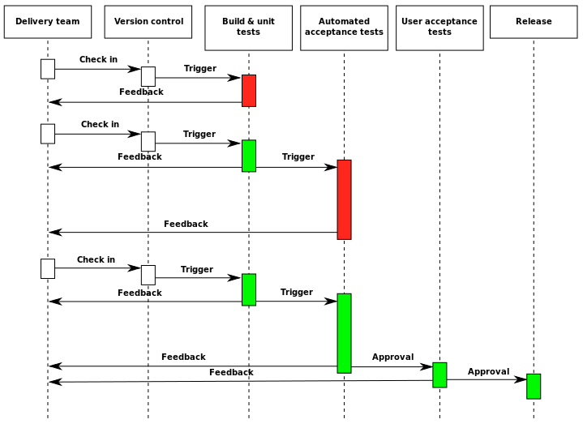

# Testing, Coding Standards, and CI/CD

## Class Goals

* Understand the basic philosophy of automated testing and Continuous Integration & Continuous Delivery (CI/CD)
* Understand the different types, terms, and strategies for automated testing.
* Understand how to adopt, adapt, and implement coding standards and improve code quality.

## Prerequisites

* A basic understanding of Python programming.
* A simple python environment including a recent python version and the ability to use pip.

## Outline

1. A Venn Diagram of Test Types/Terms
1. Test Planning & Standards
1. Unit Tests
1. Integration Tests
1. Code Standards
1. CI/CD

## A Venn Diagram of Test Types/Terms


Automated testing breaks down into several categories. Unfortunately, the popular terms don't resolve into a simple list or heirarchy. For simplicity's sake, we'll focus on just a few in particular, and mention some of the common terms and their relation to all this.

**Regression testing** is a broad term for automated testing in general. When a change is made to one part of a system, some or all of the test suite is run to ensure that the change didn't break functionality elsewhere. Should the change actually introduce or reintroduce an unintended behavior, that would be a **regression**.

**Unit tests** are written from the perspective of the code, or "units" of the codebase. Often this is at the function/method level. A developer will think through all the possible ways a function might be called and write a test case (with a single assertion) for each of those possibilities. Unit tests should almost never touch filesystems, databases, or other parts of the code. Doing so would be to have the test influenced from outside the "unit" under test. **Mocks and stubs** are often used to keep from violating this rule. When this rule is followed, large suites of unit tests can often be run *very* quickly. Some teams require all unit tests to finish in under a second.

**Integration tests** as the name implies take several units and test them together. Integration tests often take longer to run and can be built according to different strategies (bottom-up, top-down, etc.). **System tests** are integration tests that encompass the entire system under development.

**Performance testing** specifically tests performance metrics such as load time, capacity (eg. volume of concurrent users), and so on.

**Acceptance testing** is approached from the perspective of user requirements (often stated as *user stories*) and may be automated (even having an "executable specification") or manual.

## Test Planning & Standards

Like many of the topics we've covered, the metrics and standards for testing need to be agreed on by the team and adapted over time to meet the needs of the mission. **Code coverage** is a metric that is sometimes used to ensure unit tests interact with or "cover" every part of the code under test. Some teams or platforms enforce a coverage percentage to encourage thorough testing. This can backfire, though, since that percentage only represents the percentage of code under test that is *called* by the tests. It has no direct bearing on test quality.

Most teams will set requirements for tests before code can be pushed to version control, be that [TDD](https://en.wikipedia.org/wiki/Test-driven_development) or otherwise. This is often enforced by some kind of peer review which not only ensures that the code under test is being called correctly, but that all obvious cases are covered by the tests provided.

Code style, naming conventions, and so forth should also be agreed upon by the team and enforced by code review or automated means where possible.

While most of this article will be covering various types of *automated* testing, there *is* a place for manual testing and professional QA (quality assurance) personnel. This can take the form of manual approvals, staging environments, A/B testing, and other strategies. Later on we'll get into how manual testing can be integrated into a CI/CD pipeline.

## Unit Tests

Unit testing is the foundation of a good testing strategy. When errors are corrected at the unit level many obvious cases can be ruled out when problems arise in the future. High quality unit testing also forces units to be written in a very easily tested fashion. As in the "pure function" concept from functional programming:

> A function should have no side effects.

If this is the case, it becomes very easy to reason about a single function or "unit" and create predictable and easily tested behavior. As a contrived example, take this function:

```python
def add(a, b):
    return a + b
```

you may have tests such as:

```python
def test_add_positive():
    assert add(1, 2) == 3

def test_add_negative():
    assert add(-1, -2) == -3

def test_add_positive_and_negative():
    assert add(-1, 2) == 1

def test_add_zero():
    assert add(0, 0) == 0
```

In some cases you may need to fake or "mock" other behaviors to keep your tests within a given unit. For instance, given a function that performs an operation on a file:

```python
def get_lines_in_file(file_path):
    with open(file_path) as f:
        return len(f.readlines())
```

**Note:** The **with** keyword in python is used with **context manager** objects. A context manager has its own setup and tear down capability and is used to concisely establish temporary state. In this case (a file object), we **open()** the file, do some operation on it (the code within the **with** block) and automatically close out the file when we're finished.

In order to properly unit test this file we could rewrite our function to take a file object (which would be much more testable thanks to the builtin [io](https://docs.python.org/3/library/io.html) module) or for the sake of this example we could use the [unittest.mock](https://docs.python.org/3/library/unittest.mock.html) module to stub out just enough behavior to let us test this unit in isolation:

```python
from unittest.mock import patch, mock_open, Mock

import pytest


def test_get_lines_in_file_exists():
    with patch('tmp.open', mock_open(read_data='\n'*10)):
        assert get_lines_in_file('test.txt') == 10

@patch('tmp.open', Mock(side_effect=FileNotFoundError))
def test_get_lines_in_file_nofile():
    with pytest.raises(FileNotFoundError):
        get_lines_in_file('missing.txt')
```

The first test uses the **mock_open** function to create a mock file object, then we generate 10 lines of data and assert that `get_lines_in_file()` correctly returns the number 10. In the second test we use the "side_effect" argument to raise an error (as `open()` would if we passed a file path that didn't exist) and use the 3rd party [pytest](https://pytest.org) library's `raises()` function to test that the correct exception is raised.

**Note:** The second test uses a **decorator** to apply the patch function. A decorator is a wrapper on a function or class that can be used to add new behavior. In this case, the **patch()** effect is applied to this function.

## Integration Tests and Strategies

[Integration testing](https://en.wikipedia.org/wiki/Integration_testing) (treated here as a broad category of automated tests that are not unit tests) quickly becomes subjective and must be designed to accomodate the specific system[s] under test. Integration/system tests are generally run periodically (daily, weekly, etc.) depending on the size and complexity of the test suite and the system under test. Contrasted with unit tests which should be run possibly with every file save (this can be automated with editor plugins or file watchers like [ptw](https://pypi.org/project/pytest-watch/)).

## Testing Assignment

* Read the wikipedia articles on [unit](https://en.wikipedia.org/wiki/Unit_testing) (sections 1-3), and [integration](https://en.wikipedia.org/wiki/Integration_testing) testing.
* Install [PDM](https://pdm.fming.dev/) and install dependencies with `pdm install`
* Complete [quiz 1](./test_1.py) (test locally by running `pytest test_1.py`)

## Coding Standards

Coding standards can vary from team to team and project to project. It's often helpful to adopt a well-recognized existing standard as a baseline such as style guides from NASA or Google. Often there is tooling built around these standards for code editors as well as style checking tools to help enforce the standards.

When adopting a preexisting code standard there may need to be some adaptation to the particular project. In legacy codebases there may be naming conventions in violation of the style guide. Make exceptions as needed and keep the primary goals of consistency and quality at the forefront of discussions. You'll notice in the [google style guides](https://google.github.io/styleguide/) that pros and cons are listed for different rules.

When implementing the new standard it may take a while to get used to if you've come from a different way of doing things. Using formatting tools or customized linters can help keep things in line and consistent.

**Note:** git can facilitate the use of linters and formatters in pre-commit or pre-receive [hooks](https://githooks.com/).

## Style Assignment

* Use pylint to check and correct app.py
* Optional: download and add the pylintrc from the google style guide and update it to use 4 spaces.

## Continuous Integration & Continuous Delivery/Deployment (CI/CD)



Image: wikipedia

**Note:** Integration *tests* refers to integrating multiple units of code. *Continuous Integration* refers to integrating code from multiple developers.

[Continuous integration](https://en.wikipedia.org/wiki/Continuous_integration) (also referred to as "trunk-based development") is the practice of pushing changes multiple times a day to the same branch (master/main in git or "trunk" in subversion). This is accomplished with 3 elements:

1. Agreed-upon conventions within the team for avoiding long running branches and merging often.
1. An automated build and automated tests
1. A system design that is compatible with the above. (eg. feature flags)

Every push to master should trigger an automated build and run the test suite. Depending on test strategy some slower tests might be run on a schedule. A successful build should result in an artifact (installer, package, etc.) that can be deployed or used for further testing (see [black box testing](https://en.wikipedia.org/wiki/Black-box_testing)). A *failed* build should provide rapid feedback that something has broken. The committer is generally responsible to fix the build, although the whole team generally has the ability to roll back to a working state should the need arise.

### Manual Testing & Staging Environments

As mentioned earlier, there is still a need for manual testing. Some things (such as UI for example) can be difficult to test automatically, and there can be benefit to qualitative feedback on changes. A **CI/CD pipeline** may include an automated deployment to test or staging environments where testers or stakeholders can preview changes before they are published and validate new functionality and bugfixes. These alternate environments can also be a testbed for stress testing with different types of simulated user loads.

### Automated Delivery

The "CD" in CI/CD can stand for [Continuous Delivery](https://en.wikipedia.org/wiki/Continuous_delivery) or [Continuous Deployment](https://en.wikipedia.org/wiki/Continuous_deployment). In both cases the latest build should be releasable at any time. A release may take the form of publishing a new installer or launching a new version of a website or service. In Continuous Delivery, at the end of the build pipeline there should be a manual, explicit trigger (a button even) that launches the delivery process: incrementing version numbers, compiling release notes, etc.
In Continuous Deployment the build is automatically published either on a schedule or on a successful build.

Popular CI/CD systems include:

* AppVeyor
* Azure DevOps server
* Bitbucket pipelines
* CircleCI
* Github actions
* Gitlab
* Jenkins
* Travis CI

## CI/CD Assignment

* Read the wikipedia articles on [Continuous Integration](https://en.wikipedia.org/wiki/Continuous_integration), [Continuous Delivery](https://en.wikipedia.org/wiki/Continuous_delivery), and [Continuous Deployment](https://en.wikipedia.org/wiki/Continuous_deployment).
* Using github actions and everything we've covered so far, create a CI/CD pipeline that:
    1. Runs the test suite.
    1. Checks our code with pylint
    1. Publishes the "pages" directory to [github pages](https://pages.github.com/) when a push is made to the "production" branch. See [this action](https://github.com/marketplace/actions/github-pages) in the actions marketplace.

**Note:** Github pages must be enabled in your repo settings on GH. By convention pages deploys a branch called "gh-pages" though that is also a setting.
